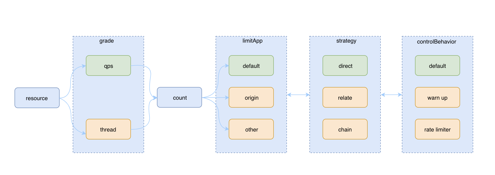
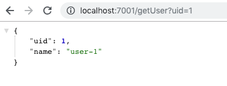
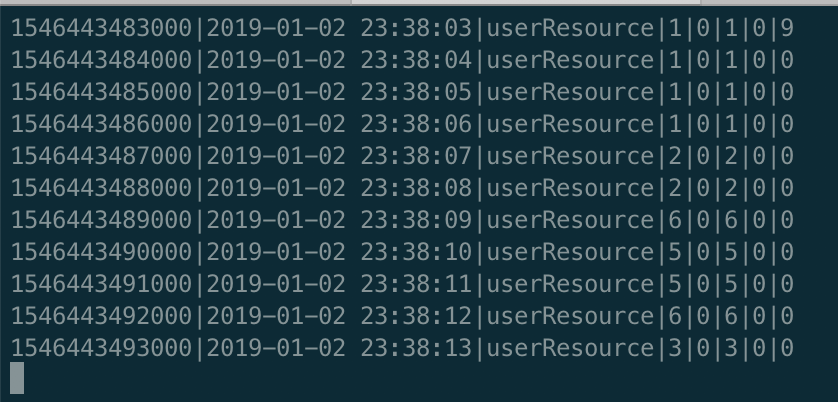

# Sentinel实战：为系统做限流保护

我们已经知道了 Sentinel 的三大功能：`限流`  `降级`  `系统保护`。现在让我们来了解下具体的使用方法，以限流来演示具体的步骤。

## 引入依赖

首先肯定是要先引入需要的依赖，如下所示：

``` xml
<dependency>
    <groupId>com.alibaba.csp</groupId>
    <artifactId>sentinel-core</artifactId>
    <version>x.y.z</version>
</dependency>
```

这里的版本号 x.y.z 可以根据需要自行选择，我选择的是截至目前为止的最新版：1.4.0。


## 定义资源

假设我们有一个 UserService ：

``` java
public class UserService {
	/**
	 * 根据uid获取用户信息
	 * @param uid uid
	 * @return 用户信息
	 */
	public User getUser(Long uid){
	    // 业务代码
	    User user = new User();
	    user.setUid(uid);
	    user.setName("user-" + uid);
        return user;
	}

	public static class User {
	    private Long uid;
	    private String name;
	    // 省略getter、setter
	}
}
```

现在我们要对 getUser 方法进行限流，那首先我们要定义一个资源，在 sentinel 中资源是抽象出来做具体的操作的，用资源来保护我们的代码和服务。

用户只需要为受保护的代码或服务定义一个资源，然后定义规则就可以了，剩下的都交给sentinel来处理了。定义完资源后，就可以通过在程序中埋点来保护你自己的服务了，埋点的方式有两种：抛出异常和返回布尔值。

下面我用抛出异常的方式进行埋点：

``` java
// 定义的资源
public static final String USER_RES = "userResource";

public User getUser(Long uid){
    Entry entry = null;
    try {
        // 流控代码
        entry = SphU.entry(USER_RES);
        // 业务代码
        User user = new User();
        user.setUid(uid);
        user.setName("user-" + uid);
        return user;
    }catch(BlockException e){
        // 被限流了
        System.out.println("[getUser] has been protected! Time="+System.currentTimeMillis());
    }finally {
        if(entry!=null){
            entry.exit();
        }
    }
    return null;
}
```

除了通过抛出异常的方式定义资源外，返回布尔值的方式也是一样的，这里不具体展开了。

PS：如果你不想对原有的业务代码进行侵入，也可以通过注解 SentinelResource 来进行资源埋点。


## 定义规则

定义完资源后，就可以来定义限流的规则了，但是我们需要对流控规则做个详细的了解，以便更好的进行限流的操作，流控的规则对应的是 FlowRule。

一条FlowRule有以下几个重要的属性组成：

- resource：规则的资源名
- grade：限流阈值类型，qps 或线程数
- count：限流的阈值
- limitApp：被限制的应用，授权时候为逗号分隔的应用集合，限流时为单个应用
- strategy：基于调用关系的流量控制
- controlBehavior：流控策略

前三个属性比较好理解，最后三个比较难理解，让我们来详细看下最后三个属性：

### limitApp

首先让我们来看下limitApp，从字面上看是指要限制哪个应用的意思，主要是用于根据调用方进行流量控制。

他有三种情况可以选择：

- default

表示不区分调用者，来自任何调用者的请求都将进行限流统计。

- {origin}

表示针对特定的调用者，只有来自这个调用者的请求才会进行流量控制。该特定调用者的名称是通过 ContextUtil.entry(origin) 来设置的。

例如：资源 `NodeA` 配置了一条针对调用者 **caller1** 的规则，那么当且仅当来自 **caller1** 对 `NodeA` 的请求才会触发流量控制。

- other

表示除 {origin} 以外的其余调用方的流量进行流量控制。

例如：资源 `NodeA` 配置了一条针对调用者 **caller1** 的限流规则，同时又配置了一条调用者为 **other** 的规则，那么任意来自非 **caller1** 对 `NodeA` 的调用，都不能超过 **other** 这条规则定义的阈值。

### strategy

基于调用关系的流量控制，也有三种情况可以选择：

- STRATEGY_DIRECT

根据调用方进行限流。ContextUtil.enter(resourceName, origin) 方法中的 origin 参数标明了调用方的身份。

如果 strategy 选择了DIRECT ，则还需要根据限流规则中的 limitApp 字段根据调用方在不同的场景中进行流量控制，包括有：“所有调用方default”、“特定调用方origin”、“除特定调用方origin之外的调用方”。

- STRATEGY_RELATE

根据关联流量限流。当两个资源之间具有资源争抢或者依赖关系的时候，这两个资源便具有了关联，可使用关联限流来避免具有关联关系的资源之间过度的争抢。

比如对数据库同一个字段的读操作和写操作存在争抢，读的速度过高会影响写得速度，写的速度过高会影响读的速度。

举例来说：read_db 和 write_db 这两个资源分别代表数据库读写，我们可以给 read_db 设置限流规则来达到写优先的目的：设置 FlowRule.strategy 为 RuleConstant.STRATEGY_RELATE，同时设置 FlowRule.refResource 为 write_db。这样当写库操作过于频繁时，读数据的请求会被限流。


- STRATEGY_CHAIN

根据调用链路入口限流。假设来自入口 Entrance1 和 Entrance2 的请求都调用到了资源 NodeA，Sentinel 允许根据某个入口的统计信息对资源进行限流。

举例来说：我们可以设置 FlowRule.strategy 为 RuleConstant.CHAIN，同时设置 FlowRule.refResource 为 Entrance1 来表示只有从入口 Entrance1 的调用才会记录到 NodeA 的限流统计当中，而对来自 Entrance2 的调用可以放行。

为什么要了解 limitApp 和 strategy 呢？主要是因为进行流控阈值判断时所需要用到的 Node 就是通过这两个字段确定的，具体来说可以用下面的表格来表示：

| strategy | limitApp           | selectedNode                                           |
| -------- | ------------------ | ------------------------------------------------------ |
| direct   | default            | clusterNode                                            |
| direct   | {origin}           | originNode                                             |
| direct   | other && !{origin} | originNode                                             |
| relate   | -                  | 特定refRes下的clusterNode                              |
| chain    | -                  | 特定context下的defaultNode，需满足：refRes=contextName |

### controlBehavior

流控策略，主要是发生拦截后具体的流量整形和控制策略，目前有三种策略，分别是：

- CONTROL_BEHAVIOR_DEFAULT

这种方式是：**直接拒绝**，该方式是默认的流量控制方式，当 qps 超过任意规则的阈值后，新的请求就会被立即拒绝，拒绝方式为抛出FlowException。

这种方式适用于对系统处理能力确切已知的情况下，比如通过压测确定了系统的准确水位。

- CONTROL_BEHAVIOR_WARM_UP

这种方式是：**排队等待** ，又称为 **冷启动**。该方式主要用于当系统长期处于低水位的情况下，流量突然增加时，直接把系统拉升到高水位可能瞬间把系统压垮。

通过"冷启动"，让通过的流量缓慢增加，在一定时间内逐渐增加到阈值上限，给冷系统一个预热的时间，避免冷系统被压垮的情况。

- CONTROL_BEHAVIOR_RATE_LIMITER

这种方式是：**慢启动**，又称为 **匀速器模式**。这种方式严格控制了请求通过的间隔时间，也即是让请求以均匀的速度通过，对应的是漏桶算法。

这种方式主要用于处理间隔性突发的流量，例如消息队列。想象一下这样的场景，在某一秒有大量的请求到来，而接下来的几秒则处于空闲状态，我们希望系统能够在接下来的空闲期间逐渐处理这些请求，而不是在第一秒直接拒绝多余的请求。

具体的 FlowRule 可以用下面这张图表示：



规则定义好了之后，启动应用后，就会自动对我们的业务代码进行保护了，当然实际生产环境中不可能通过硬编码的方式来定义规则的，sentinel 为我们提供了 DataSource 接口，通过实现该接口可以自定义规则的存储数据源。

通过 DataSource 接口可以有很多种方式对规则进行持久化，例如：

- 整合动态配置系统，如 ZooKeeper、[Nacos](https://github.com/alibaba/Nacos) 等，动态地实时刷新配置规则
- 结合 RDBMS、NoSQL、VCS 等来实现该规则
- 配合 Sentinel Dashboard 使用

本篇文章不对规则的持久化做具体的介绍，本篇文章主要是实现一个简单的限流的例子的接入。

**PS：DateSource 接口在后期已经被拆成 ReadableDataSource 和 WritableDataSource 接口了。**


### 查看日志

我们通过一个Spring Boot项目来启动，其中 UserService 作为一个项目中一个具体的服务，项目启动好之后，会在 ${user_home}/logs/csp/ 目录下创建一个 sentinel-record.log.\${date} 的日志文件，该文件会记录 sentinel 的重要的行为，我本地的日志文件如下所示：


从上图中可以看到，除了 sentinel-record 之外，还有 sentinel-exception 文件，从命名上就可以知道这个文件是记录 sentinel 运行过程中出现的异常的。

让我们打开 sentinel-record.log.2019-01-02.0 的文件看下具体的内容：


sentinel-record 日志中会记录加载好的规则等信息，具体的实时统计日志会在另一个 叫 xx-metrics.log.${date} 的文件中。


### 查看统计效果

首先我们要访问一下我们的服务，触发了 sentinel 的限流规则后，才会生成具体的统计文件。



可以发现该方法成功返回了，现在让我们来看看 ~/logs/csp/ 目录下生成的统计文件，如下图所示：


该统计文件的命名方式是 \${appName}-metrics.log.\${date} ，其中 \${appName} 会优先获取的系统参数 project.name 的值，如果获取不到会从启动参数中获取，具体的获取方式在 AppNameUtil 类中。

我们打开 lememo-retircs 文件，看到如下的信息：



可以看到我们请求了很多次该资源后，sentinel 把每秒的统计信息都打印出来了，用 | 来分隔不同的参数，一共有8个参数，从左至右分别是：

| 参数      | 含义                   |
| --------- | ---------------------- |
| timestamp | 时间戳                 |
| datetime  | 时间                   |
| resource  | 访问的资源             |
| p         | 通过的请求数           |
| block     | 被阻止的请求数         |
| s         | 成功执行完成的请求数   |
| e         | 用户自定义的异常       |
| rt        | 平均响应时长，单位为ms |

可以看到我们的请求都已经成功通过了，现在我们把规则中设置的 count 阈值改为1，然后重启服务后，再次请求该服务，然后再次打开 lememo-metrics 文件，如下图所示：


可以看到每秒中只有1个请求通过了，其他的都被 block 了，再看我们在代码中打印的日志：


本篇文章通过一个例子对 sentinel 的限流进行了实战，了解了规则的详细作用，也知道通过 sentinel 打印的日志来查看运行过程中状态。

但是这种方式比较原始，不管是创建规则，还是查看日志，下篇文章我将通过 sentinel 自带的控制台带大家了解具体的作用。


